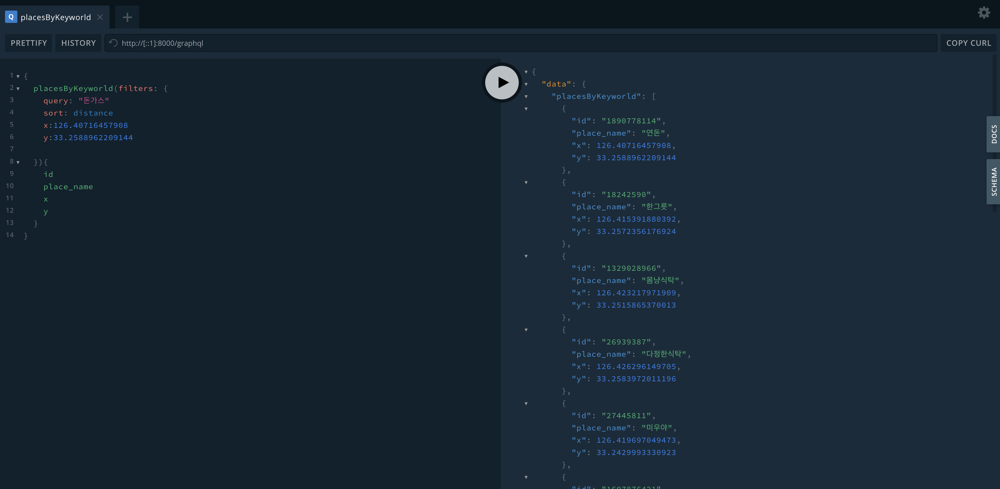

# `데동여지도` 🗺️❤️

> 위치기반 데이트 기록/공유 웹

<p align="center">
  <a href="http://nestjs.com/" target="blank"></a>
</p>

[circleci-image]: https://img.shields.io/circleci/build/github/nestjs/nest/master?token=abc123def456
[circleci-url]: https://circleci.com/gh/nestjs/nest

  <p align="center">A progressive <a href="http://nodejs.org" target="_blank">Node.js</a> framework for building efficient and scalable server-side applications.</p>
    <p align="center">
<a href="https://www.npmjs.com/~nestjscore" target="_blank"></a>
<a href="https://www.npmjs.com/~nestjscore" target="_blank"></a>
<a href="https://www.npmjs.com/~nestjscore" target="_blank"></a>
<a href="https://circleci.com/gh/nestjs/nest" target="_blank"></a>
<a href="https://coveralls.io/github/nestjs/nest?branch=master" target="_blank"></a>
<a href="https://discord.gg/G7Qnnhy" target="_blank"></a>
<a href="https://opencollective.com/nest#backer" target="_blank"></a>
<a href="https://opencollective.com/nest#sponsor" target="_blank"></a>
  <a href="https://paypal.me/kamilmysliwiec" target="_blank"></a>
    <a href="https://opencollective.com/nest#sponsor"  target="_blank"></a>
  <a href="https://twitter.com/nestframework" target="_blank"></a>
</p>

<!-- TOC -->

- [`데동여지도` 🗺️❤️](#데동여지도-️️)
  - [1. 프로젝트 실행(local)](#1-프로젝트-실행local)
  - [2. 의존성 세팅](#2-의존성-세팅)
  - [3. 프로젝트 세팅](#3-프로젝트-세팅)
  - [4. 프로젝트 구조](#4-프로젝트-구조)
  - [5. Playground](#5-playground)
  - [6. infrastructure](#6-infrastructure)
  - [7. API](#7-api)
  - [8. LINKS](#8-links)
  - [9. SCHEMA of GraphQL API](#9-schema-of-graphql-api)
  - [10. deploy sandbox](#10-deploy-sandbox)
    - [Heroku](#heroku)
  - [deploy production](#deploy-production)
    - [gcp cloud run](#gcp-cloud-run)
    - [mongodb atlas](#mongodb-atlas)
    - [Cloud Run CD](#cloud-run-cd)
  - [mapbox](#mapbox)

<!-- /TOC -->

## 1. 프로젝트 실행(local)

```
npm run start:dev
```

## 2. 의존성 세팅

- 의존성

```bash
# mongo
npm i @nestjs/mongoose mongoose
npm i -D @types/mongoose

# DTO 재사용
npm i @nestjs/mapped-types

# https://github.com/typestack/class-validator#validation-decorators
# for dto validation
npm i class-validator


# https://docs.nestjs.com/techniques/serialization
# serialization(before return Response)
# 필드 exclude등 유용하게 활용
npm i class-transformer

# import { Request } from 'express';
# Request object를 세부적으로 다루기 위해 필요
npm i @types/express

# nestjs graphql dep
# https://docs.nestjs.com/graphql/quick-start
npm i @nestjs/graphql graphql-tools graphql apollo-server-express

# https://dev.to/kop7/how-to-build-autocomplete-search-with-nestjs-elasticsearch-and-vue-12h8
# https://github.com/nestjsx/nestjs-config
npm i dotenv

# cache
# https://github.com/BryanDonovan/node-cache-manager#store-engines
npm install cache-manager
# https://github.com/v4l3r10/node-cache-manager-mongodb
npm install cache-manager-mongodb --save

# for test
npm i --save-dev mongodb-memory-server 

# configservice
# https://medium.com/the-crowdlinker-chronicle/creating-config-files-in-nestjs-dcd059ae15e4
npm i @nestjs/config
```

## 3. 프로젝트 세팅

> [realworld-example-app](https://github.com/lujakob/nestjs-realworld-example-app)를 best-practice로 구조 참조

```bash
nest g mo user
nest g mo emoji
nest g mo comment
nest g mo spot
nest g mo place
cd src && mkdir shared && mkdir config
```

## 4. 프로젝트 구조

```bash
├── src
│   ├── comment
│   ├── sticker
│   ├── place
│   ├── shared
│   ├── spot
│   ├── course
│   └── user
│   └── config
```

기본적으로 모듈 폴더가 각 도메인(entity)을 담당합니다.

- `comment/`
  - `spot`에 대한 댓글
- `sticker/`
  - 지도에 보여질 스티커
  - 코스 생성에 필요한 기본 단위로 위치정보를 가지는 spot을 ref로 지닌다.
  - 사용자가 `sticker`를 생성하게 되면, 해당 위치에 spot이 자동으로 생성 또는 업데이트 된다.
- `place/`
  - `카카오 지역검색 API`를 통해 받아올 장소에 대한 정보
  - 매번 유저가 쿼리를 보낼 때마다, api로 장소 데이터를 받아오는게 비효율적이라면, 한번 요청된 데이터는 캐싱한다. (mongo 재활용 또는 redis 사용)
- `shared/`
  - 각 domain들이 공통으로 사용할 util
- `spot/`
  - `place` + `comment` `||` `emoji`
  - 기본적으로 `place/`데이터는 캐시는 되어도, db에 저장되지 않기 때문에, 상태를 가지게 되면 spot이라는 entity를 활용해 db에 저장시킵니다.
  - 총 3가지 경로로 생성/업데이트 된다.
    1. 유저가 sticker를 지도에 붙이는 경우
    2. 유저가 채팅방을 생성하는 경우(변경될 가능성 있음)
    3. 유저가 customSpot을 생성하는 경우(place정보를 카카오로부터 받을 수 없기 때문에 유저가 기입해줘야함)
- `course/`
  - 스티커들을 사용해 생성되는 데이트 코스 정보
- `user`
  - 사용자 도메인
- `config`
  - env 환경값 관리 모듈(database, 3rd-party api)

## 5. Playground



```bash
$ npm run start:dev
# open http://[::1]:8000/graphql
```

- 지역검색 query 예시 [// API 스키마 전체 ⬇](#SCHEMA-of-GraphQL-API)
  - **sort를 distance로 하게되면 x,y는 필수로 넣어주어야 합니다.**

```
{
  placesByKeyworld(filters: {
    query: "돈가스"
    sort: distance
    x:126.40716457908
    y:33.2588962209144
  }){
    id
    place_name
    x
    y
  }
}

mutation {
  createSpot(createSpotInput: {
    _id: "1890778114"
    place_name: "연돈"
    x:126.40716457908
    y:33.2588962209144
  }){
   _id
    place_name
    x
    y
  }
}
```

## 6. infrastructure

- 로컬 mongodb 세팅

```bash
docker run --name mongo -p 0.0.0.0:27017:27017 -d mongo
```

## 7. API

- 카카오
  - [지역 REST api](https://developers.kakao.com/docs/latest/ko/local/dev-guide#search-by-keyword)
  - [지도 jdk](https://apis.map.kakao.com/web/guide/)
    - 지역 검색 가능
    - 라이브러리를 사용하면, 마크, 클러스터링 등 다양한 서비스도 사용가능
- 네이버(depreacted): 20.07 기준 검색 max 5개로 실사용 불가능
  - [네이버 검색(지역)](https://developers.naver.com/docs/search/local/): 식당, 정보를 검색하면 매칭되는 place object를 넘겨준다.
  - [네이버 지도](https://www.ncloud.com/product/applicationService/maps): 지도를 그려준다.
    - [좌표계 변환 이슈](https://github.com/navermaps/maps.js/issues/285)
    - [길찾기 api](https://apidocs.ncloud.com/ko/ai-naver/maps_directions/)
      - 주의사항으로 jdk 제공 되지 않는 듯하다.

## 8. LINKS

- [이슈: 네이버 지도에 네이버 검색 결과를 같이 띄울 수 없을까?](https://github.com/navermaps/maps.js/issues/193)
- [configService 의존성 주입](https://dev.to/kop7/how-to-build-autocomplete-search-with-nestjs-elasticsearch-and-vue-12h8)

## 9. SCHEMA of GraphQL API

```
directive @specifiedBy(url: String!) on SCALAR
input KeywordSearchDto {
  query: String!
  category_group_code: String
  x: Float
  y: Float
  radius: Int
  rect: String
  page: Int
  size: Int
  sort: SortType
}

type Place {
  id: String!
  place_name: String!
  category_name: String
  category_group_code: String
  category_group_name: String
  phone: String
  address_name: String
  road_address_name: String
  place_url: String
  distance: String
  x: Float
  y: Float
}

type Query {
  placesByKeyworld(filters: KeywordSearchDto!): [Place!]!
}

enum SortType {
  distance
  accuracy
}
```

## 10. deploy sandbox
> [ref](https://www.joshmorony.com/deploying-a-production-nestjs-server-on-heroku/)


### Heroku
- 환경 세팅

```bash
brew tap heroku/brew && brew install heroku
heroku login
npm i -g heroku-dotenv # heroku가 .env 환경 못읽기 때문
```

- deploy

```bash
heroku git:remote -a korean-date-map # app name is korean-date-map
git checkout main

heroku config:set NPM_CONFIG_PRODUCTION=false
heroku config:set NODE_ENV=production
heroku-dotenv push

git add .
git commit -am "heroku deploy"
git push heroku main
git push origin main
```

- mongodb 세팅
  - [mongodb 서버 생성](https://docs.ncloud.com/ko/database/database-10-1.html)
  - [공인 ip 신청](https://docs.ncloud.com/ko/database/database-10-4.html)
  - [auth 설정](https://stackoverflow.com/questions/27784956/error-couldnt-add-user-not-authorized-on-test-to-execute-command-createuser)
```bash
ssh -p 11111 root@101.101.163.214
passwd mongodb
su mongodb
mongo --port 27017
use admin
db.createUser({ user: "<아이디>", pwd: "<비번>", roles: ["root" ] })
# db.updateUser("nexters",{roles : ["userAdminAnyDatabase","userAdmin","readWrite","dbAdmin","clusterAdmin","readWriteAnyDatabase","dbAdminAnyDatabase"]});

use <db이름1>
db.createUser({ user: "<아이디>", pwd: "<비번>", roles: ["readWrite", "dbAdmin" ] })
use <db이름2>
db.createUser({ user: "<아이디>", pwd: "<비번>", roles: ["readWrite", "dbAdmin" ] })


cat /home/mongodb/db/log/mongod.log # 로깅
tail -f /home/mongodb/db/log/mongod.log # 로깅 테일링

> db.serverStatus().connections # 커넥션 갯수 확인
{ "current" : 47, "available" : 772, "totalCreated" : 79 }


# 필드 수정
db.stickers.updateMany({}, {$rename: {"sticker_category": "sticker_index"}});
db.stickers.updateMany({}, { $set: {  "sticker_index": Math.floor(Math.random() * (11 - 0 + 1)) + 0, "sweet_percent":50 }});

# db.stickers.find({sticker_category: {$exists : true }}).forEach(s => {
#   print(Math.floor(Math.random() * (11 - 0 + 1)) + 0, choices[Math.floor(Math.random() * choices.length)]);
# });

const choices = [0, 30, 50, 70, 100];
db.stickers.find().forEach(s => {
  db.stickers.update({_id: s._id}, 
    {$set: {"sticker_index": Math.floor(Math.random() * (11 - 0 + 1)) + 0, "sweet_percent":choices[Math.floor(Math.random() * choices.length)]} }
    );
});

```
## deploy production

### gcp cloud run

- build docker
```
# docker build -t asia.gcr.io/daedongyeomap/backend .
# docker run -p 8080:8080 -d asia.gcr.io/daedongyeomap/backend daedongmap
```
- docker push
```
gcloud auth login
gcloud auth configure-docker
docker push asia.gcr.io/daedongyeomap/backend

# https://console.cloud.google.com/gcr/images/daedongyeomap?project=daedongyeomap
```

- cloud deploy
```
gcloud run deploy --image gcr.io/daedongyeomap/backend --platform managed
# [5] asia-northeast3 == asia/seoul
```
- [서버리스 VPC 액세스 커넥터 만들기](https://cloud.google.com/vpc/docs/configure-serverless-vpc-access#creating_a_connector)
- [고정 아웃바운드 IP 주소](https://cloud.google.com/run/docs/configuring/static-outbound-ip)
```
$ gcloud compute networks list
$ gcloud compute routers create daedong-router \
  --network=default \
  --region=asia-northeast3

NAME            REGION           NETWORK
daedong-router  asia-northeast3  default

$ gcloud compute addresses create daedong-ip --region=asia-northeast3
$ gcloud compute routers nats create daedong-nat \
  --router=daedong-router \
  --region=asia-northeast3 \
  --nat-all-subnet-ip-ranges \
  --nat-external-ip-pool=daedong-ip

$ gcloud beta run deploy daedongyeomap \
   --image=asia.gcr.io/daedongyeomap/backend \
   --vpc-connector=daedong-connector \
   --vpc-egress=all

# 고정 ip 확인
https://console.cloud.google.com/networking/addresses/list?folder=&organizationId=&project=daedongyeomap
```

- [env 관리](https://console.cloud.google.com/run/deploy/asia-northeast3/daedongyeomap?project=daedongyeomap)
  - sandbox, production의 경우
  - 추가로 configuration.ts

- [도메인 등록](https://cloud.google.com/run/docs/mapping-custom-domains)

- [cloud storage 이미지 upload]
- [cloud App engine]()
```
$ gcloud app deploy

File upload done.
Updating service [default]...done.
Setting traffic split for service [default]...done.
Deployed service [default] to [https://daedongyeomap.du.r.appspot.com]

You can stream logs from the command line by running:
  $ gcloud app logs tail -s default

To view your application in the web browser run:
  $ gcloud app browse
```
### mongodb atlas
```javascript

const MongoClient = require('mongodb').MongoClient;
const uri = "mongodb+srv://<user>:<password>@cluster1.96jmq.mongodb.net/<dbname>?retryWrites=true&w=majority";
const client = new MongoClient(uri, { useNewUrlParser: true });
client.connect(err => {
  const collection = client.db("test").collection("devices");
  // perform actions on the collection object
  client.close();
});
```

### Cloud Run CD
> [cloudbuild.yaml](https://cloud.google.com/build/docs/deploying-builds/deploy-cloud-run)

```
$ gcloud builds submit
```


## mapbox

```
npm install mapbox-gl --save
<link href='https://api.mapbox.com/mapbox-gl-js/v2.1.0/mapbox-gl.css' rel='stylesheet' />
```